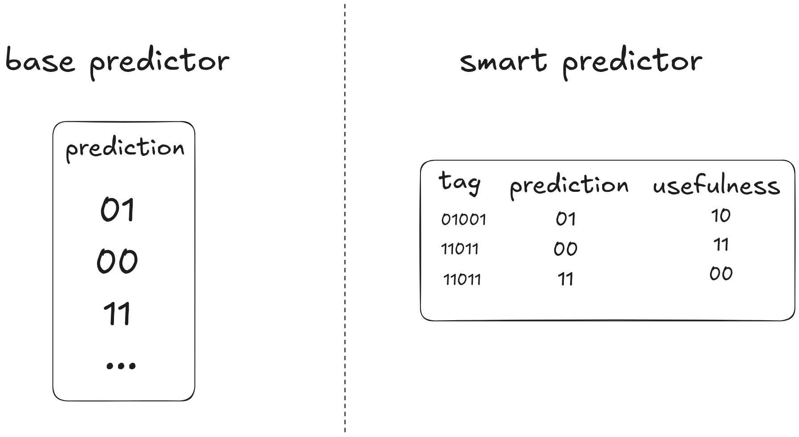

# TAGE branch prediction simulator

TAGE (TAgged GEometric history length) - is a modern branch prediction algorithm. I created this project to better understand how it works under the hood.

! there could be mistakes in code and README, as I wrote it without AI to actually understand what I was doing !


# How do I run this

Just clone this repo and run `cargo run`. There is one trace file included in traces directory, others are in `traces.tar.gz` (because it's ~400Mb uncompressed)

```rust
const AMOUNT_OF_FILES: usize = 10;
```
you can change this global variable to select how many files are there.

# The problem




CPU's are fast, while RAM is significantly slower. When running, the program is being loaded in RAM and then is being accessed part by part by the CPU. Usually that is okay, because the processor gets instructions with batches as opposed to getting them one by one, which would force it to wait for every instruction. But sometimes (e.g in 'if' clauses) this rule fails and the CPU does not know, what to load, which results in stalling.

# Solutions:

- wait for the condition to tell us what instructions to load
- fixed prediction: always true/ always false
- load the adjacent chunk of instructions
- BTFN (Backward Taken / Forward Not Taken) - assume taken in loops and not taken otherwise
- 1 bit predictor: store the last state in an array, indexed by PC (program counter)
- 2 bit predictor: the same as the previous one, but with 2 bits, which improves the predictions significantly, as it does not let noise mess up the predictions

The standart bimodal predictor (2 bit predictor) works great for simple patterns but struggles with harder ones, to fix this we can add history to the standart model but it would introduce excesive memory usage most of the time, so the main idea of TAGE aproach is to add complexity to predictor, if it does a bad job.


# How the history is storedf
To store the history in a smaller tag we need hashing. For this I use rounded shifts and XOR's. Additionaly I clear the impact of the exiting bit using XOR

```rust
  fn update(&mut self, new_bit: bool, old_bit: bool) {
        if self.out_bits == 0 {
            return;
        }
        let mut new_val = (self.val << 1) | (self.val >> (self.out_bits - 1));
        new_val &= (1 << self.out_bits) - 1;
        new_val ^= new_bit as u64;

        let old_pos = self.hist_len % self.out_bits;
        new_val ^= (old_bit as u64) << old_pos;

        self.val = new_val;
    }
```